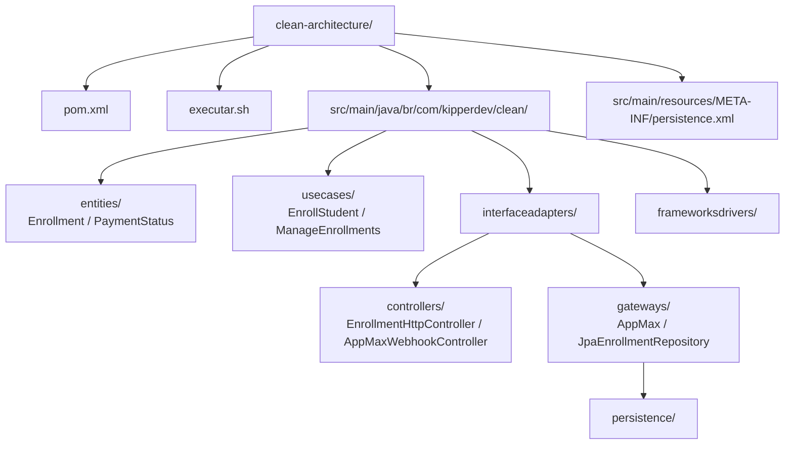
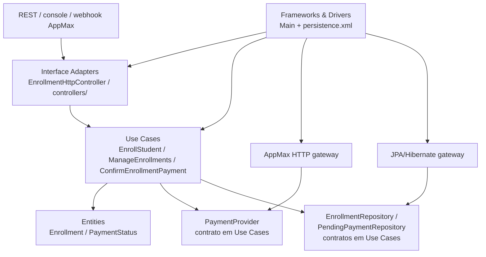

# Matrículas — Clean Architecture

Aplicação Java 17+ com JPA/Hibernate e H2 em arquivo, organizada pelas quatro áreas nomeadas por Robert C. Martin: **Entities**, **Use Cases**, **Interface Adapters** e **Frameworks & Drivers**. Requer Maven 3.9+.

## Ideia da arquitetura

Robert C. Martin apresenta a arquitetura como círculos concêntricos: regras de negócio mais gerais ficam no centro; detalhes de interface, persistência, frameworks e serviços externos ficam nas áreas externas. A regra que mantém essa separação é a **Dependency Rule**: dependências no código-fonte apontam para dentro. Assim, entidades e casos de uso não precisam conhecer JPA, H2, AppMax ou a interface de console.

Neste exemplo, `Enrollment` e `PaymentStatus` guardam conceitos e regras centrais. `EnrollStudent` e `ConfirmEnrollmentPayment` coordenam os casos de uso. Os controllers convertem chamadas externas em pedidos compreendidos pelos casos de uso; os gateways traduzem os contratos internos para AppMax e JPA. `Main` escolhe e conecta as implementações concretas. Interfaces como `PaymentProvider` e `EnrollmentRepository` ficam junto dos casos de uso; os gateways externos implementam esses contratos.

## Estrutura do projeto



## Organização e dependências

As setas do diagrama mostram dependências no código-fonte. Gateways dependem dos contratos definidos na camada Use Cases; os casos de uso dependem das Entities. O ponto de composição conhece as implementações externas para conectá-las.



O fluxo em execução pode atravessar uma fronteira para chamar uma implementação externa. As dependências do código continuam apontando para as políticas internas; por exemplo, `JpaEnrollmentRepository` implementa `EnrollmentRepository`, que pertence a `usecases/`.

## Demonstração local

```sh
# A partir da raiz do repositório
cd clean-architecture
./executar.sh api
```

Requisitos: JDK 17 ou superior e Maven 3.9 ou superior. `api` é o modo padrão e pode ser omitido (`./executar.sh`). O comando compila e inicia uma API REST local no modo de simulação, sem chamar a AppMax. Para rodar a demonstração pelo console, use `./executar.sh demo`.

O servidor usa o simulador AppMax e grava em `./data/enrollments.mv.db` (H2); novos IDs são confirmados no simulador, enquanto `enr-bia` fica pendente e `enr-clara` é recusada. A demonstração por console (`./executar.sh demo`) usa esses três casos e só matricula Ana. Nenhum dos modos simulados acessa serviços externos.

Configure outro arquivo H2 com `DATABASE_URL='jdbc:h2:file:/caminho/enrollments;DB_CLOSE_ON_EXIT=FALSE'`. O Hibernate aplica o schema a partir das entidades JPA (`hibernate.hbm2ddl.auto=update`); não há scripts SQL de schema.

## API REST de matrículas

A API escuta em `127.0.0.1:8080`; configure outra porta com `API_PORT`. As rotas recebem e retornam JSON:

| Método | Rota | Operação |
|---|---|---|
| `GET` | `/api/enrollments` | Lista matrículas confirmadas |
| `GET` | `/api/enrollments/{id}` | Busca uma matrícula |
| `POST` | `/api/enrollments` | Cobra e cria matrícula se o pagamento for confirmado |
| `PUT` | `/api/enrollments/{id}` | Atualiza nome do estudante e curso |
| `DELETE` | `/api/enrollments/{id}` | Remove a matrícula |

O `id` e o valor cobrado são imutáveis na atualização, para manter a matrícula ligada ao pagamento original. O modo simulado confirma novos IDs por padrão; `enr-bia` permanece pendente e `enr-clara` é recusada. No modo AppMax HTTP, `POST` cria uma cobrança PIX e responde `202` enquanto aguarda confirmação autenticada pelo webhook e consulta à API AppMax.

A API de exemplo escuta somente em `127.0.0.1` e não inclui autenticação.

```sh
curl http://127.0.0.1:8080/api/enrollments
curl -i -X POST http://127.0.0.1:8080/api/enrollments \
  -H 'Content-Type: application/json' \
  -d '{"id":"enr-joana","student":"Joana","course":"Arquitetura","amountInCents":10000}'
curl -i http://127.0.0.1:8080/api/enrollments/enr-joana
curl -i -X PUT http://127.0.0.1:8080/api/enrollments/enr-joana \
  -H 'Content-Type: application/json' \
  -d '{"student":"Joana Silva","course":"Clean Architecture"}'
curl -i -X DELETE http://127.0.0.1:8080/api/enrollments/enr-joana
```

## AppMax HTTP com PIX

O modo HTTP é explícito e usa merchant credentials obtidas no processo de instalação do app. Credenciais do aplicativo não servem para criar clientes/pedidos/pagamentos. Nenhuma credencial fica no código.

Defina no ambiente:

```sh
APPMAX_MODE=http
APPMAX_ENV=sandbox                         # sandbox ou production
APPMAX_MERCHANT_CLIENT_ID=...
APPMAX_MERCHANT_CLIENT_SECRET=...
APPMAX_CUSTOMER_FIRST_NAME=...
APPMAX_CUSTOMER_LAST_NAME=...
APPMAX_CUSTOMER_EMAIL=...
APPMAX_CUSTOMER_PHONE=...
APPMAX_CUSTOMER_IP=...                    # valor obtido do Appmax JS no checkout
APPMAX_CUSTOMER_DOCUMENT_NUMBER=...       # CPF/CNPJ necessário para PIX
APPMAX_WEBHOOK_PORT=8081
```

Também é possível definir `APPMAX_AUTH_BASE_URL` e `APPMAX_API_BASE_URL`; ambas precisam ser origens HTTPS. Sem override, sandbox seleciona `auth.sandboxappmax.com.br` e `api.sandboxappmax.com.br`; produção seleciona os domínios `auth.appmax.com.br` e `api.appmax.com.br`. Depois de configurar essas variáveis, execute `./executar.sh api`. A aplicação inicia a API REST na porta `8080` e o webhook na porta `8081`. Um `POST /api/enrollments` solicita OAuth client credentials, cria cliente e pedido digital, gera PIX e persiste a cobrança pendente. A resposta `202` inclui as instruções EMV/QR e a expiração.

O campo de IP deve vir do callback do Appmax JS no checkout web. Este exemplo Java de console recebe esse dado por variável de ambiente para mostrar a fronteira; não implementa o checkout de navegador que coleta o IP. Não envie PAN ou CVV a este backend: o fluxo implementado só cria PIX. O parser trata os campos PIX tanto sob `data.payment.pix_*` quanto sob `data.pix` (`emv_code`, `qr_code`, `expires_at`), que aparecem em páginas diferentes da documentação atual.

### Confirmação assíncrona

O modo HTTP inicia `POST /webhooks/appmax` na porta padrão `8081` e mantém um worker lendo a inbox persistente. O webhook aceita somente `order_approved`, `order_paid_by_pix` e `order_integrated` do tipo `order`; ele salva o payload e responde rapidamente. São aceitos os formatos `data.order.id` e `data.order_id` documentados nos exemplos/referência da AppMax. O worker consulta `GET /v1/orders/{order_id}` autenticado com Bearer e só libera matrícula se o pedido retornado tiver o mesmo ID, status `aprovado` ou `integrado` e `total_paid` igual ao valor esperado em centavos. `pendente`, `autorizado`, valor divergente e outros estados não liberam acesso. A inbox é deduplicada por evento+pedido, tem retry com intervalo e a confirmação/persistência é transacional no H2 via JPA.

A AppMax documenta que não envia assinatura HMAC nem token nos webhooks. Portanto o endpoint não inventa nem valida uma assinatura inexistente; o payload é somente um gatilho não confiável, e o status consultado pela API é a fonte de verdade. Publique-o somente atrás de HTTPS, configure a URL pública no app AppMax e habilite permissões dos eventos. O exemplo não implementa allowlist oficial de IP porque a documentação não fornece uma lista estável. Proteja a URL na borda de rede e monitore retries/falhas.

## Círculos da Clean Architecture

- `entities/`: entidades e regras gerais da matrícula, sem depender de UI, persistência ou AppMax.
- `usecases/`: regras específicas da aplicação. `PaymentProvider`, `EnrollmentRepository` e `PendingPaymentRepository` são abstrações internas que o caso de uso chama; as implementações concretas ficam no círculo externo.
- `interfaceadapters/controllers/`: controllers HTTP REST, console e webhook; convertem requisições externas para chamadas de caso de uso.
- `interfaceadapters/gateways/`: adapters que traduzem AppMax e persistência JPA/Hibernate para os contratos usados pelos casos de uso.
- `interfaceadapters/gateways/persistence/`: entidades ORM e mapeamento para matrícula, pagamento pendente, inbox de webhook e confirmação.
- `frameworksdrivers/`: `Main`, ponto de composição e configuração concreta de frameworks e ferramentas.
- `src/main/resources/META-INF/persistence.xml`: configuração do provedor JPA.

## Regra de dependência

O código fonte depende somente para dentro: Entities não conhece Use Cases; Use Cases depende de suas abstrações internas; Interface Adapters implementam essas abstrações e conhecem os detalhes externos; Frameworks & Drivers monta os componentes concretos. O sentido do fluxo em execução pode atravessar os círculos para fora, mas as dependências de código continuam apontando para as políticas internas. Esta é a regra que define a arquitetura; os nomes dos pacotes apenas espelham os círculos originais.

O simulador continua como padrão. H2 em arquivo mantém a demonstração independente e adequada a desenvolvimento; avalie banco gerenciado para produção. Para operação real, a AppMax exige merchant instalar/autorizar o app, configurar URL de webhook e conceder as permissões de evento. Valide sandbox e as credenciais/conta do merchant antes de usar produção. Não há cobrança AppMax real verificada neste exemplo.

## Build

```sh
mvn clean package
mvn exec:java
```

O projeto usa Hibernate ORM `7.4.12.Final`, H2 e Jackson como dependências Maven. A série Hibernate 7.4 declara suporte a Java 17 e Jakarta Persistence 3.2.

## Referências

- AppMax [Quickstart](https://docs.appmax.com.br/quickstart), [PIX](https://docs.appmax.com.br/api-reference/payments/pix), [Consultar pedido](https://docs.appmax.com.br/api-reference/orders/consultar-pedido), [Webhooks](https://docs.appmax.com.br/guides/webhooks), [Exemplo completo](https://docs.appmax.com.br/guides/exemplo-integracao), [Ambientes](https://docs.appmax.com.br/guides/ambientes), [Autenticação](https://docs.appmax.com.br/guides/autenticacao) e [Appmax JS](https://docs.appmax.com.br/guides/appmax-js).
- Robert C. Martin, [The Clean Architecture](https://blog.cleancoder.com/uncle-bob/2012/08/13/the-clean-architecture.html).
