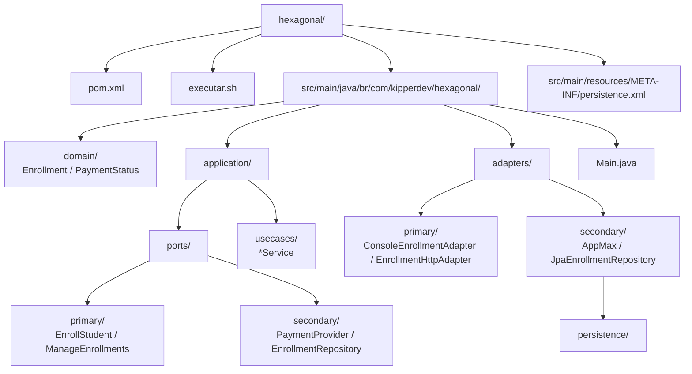
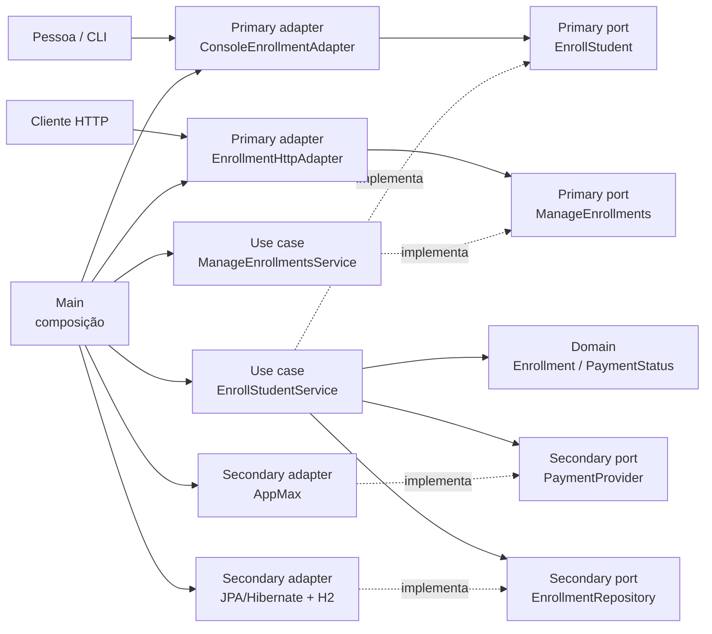

# Matrículas — Arquitetura Hexagonal

Versão independente em Java 17+ da arquitetura Ports & Adapters de Alistair Cockburn. O núcleo da aplicação define **ports** conforme as conversas que precisa oferecer ou solicitar. **Primary adapters** acionam a aplicação; **secondary adapters** são acionados por ela para falar com pagamentos ou persistência. A persistência usa JPA com Hibernate e H2 em arquivo, sem Spring. As entidades JPA ficam no lado secondary.

## Ideia da arquitetura

No artigo original, Cockburn descreve uma aplicação que pode funcionar sem depender de uma interface de usuário ou de um banco específico. Uma **port** representa uma conversa com um propósito; um **adapter** traduz uma tecnologia concreta para essa conversa. Assim, a aplicação pode ser acionada por diferentes atores e pode conversar com implementações substituíveis de serviços externos.

Cockburn chama de **primary** os ports e adapters pelos quais um ator dirige a aplicação. Chama de **secondary** os ports e adapters usados quando a própria aplicação dirige uma conversa, por exemplo com um provedor de pagamento ou banco de dados. O critério é quem inicia a conversa, e não se a tecnologia é “entrada” ou “saída”.

Neste projeto, `EnrollStudent`, `ManageEnrollments`, `CreatePixEnrollment` e `CheckPixEnrollment` são primary ports implementadas pelos casos de uso. O console e a API HTTP são primary adapters. `PaymentProvider`, `PixPaymentProvider` e `EnrollmentRepository` são secondary ports; adapters AppMax e JPA/Hibernate implementam esses contratos. `Main` conecta uma combinação concreta. Os nomes das pastas refletem os termos primary/secondary; são uma organização deste projeto, não uma árvore de diretórios obrigatória definida por Cockburn.

## Estrutura do projeto



## Organização por ports e adapters

As setas contínuas indicam chamadas em execução; as setas tracejadas indicam dependência/implementação de contrato. O núcleo contém as ports e os casos de uso; adapters concretos dependem dessas ports para traduzir console, AppMax e JPA/H2.



Os comandos `pix-create` e `pix-check` exercitam as outras duas primary ports. O diagrama simplifica a composição: `Main` também conecta seus respectivos casos de uso e o adapter de Pix.

```sh
# A partir da raiz do repositório
cd hexagonal
./executar.sh api
```

A execução requer JDK 17 ou superior e Maven 3.9 ou superior. `api` é o modo padrão e pode ser omitido (`./executar.sh`). Ele inicia a API HTTP em `127.0.0.1:8080`, usa o simulador local e persiste com JPA/Hibernate em H2. O script compila e inicia a aplicação com `mvn compile exec:java`. Para executar a demonstração pelo console, rode `./executar.sh demo`.

## API CRUD de matrículas

A API recebe JSON em `http://127.0.0.1:8080/api/enrollments`; configure outra porta com `API_PORT`. A criação passa pela primary port `EnrollStudent` e só grava a matrícula quando o pagamento está confirmado. Uma criação pendente retorna `202` e ainda não aparece nas consultas. No simulador, novos IDs são confirmados por padrão; `enr-bia` fica pendente e `enr-clara` é recusada.

| Método | Rota | Operação |
|---|---|---|
| `GET` | `/api/enrollments` | Lista matrículas confirmadas |
| `GET` | `/api/enrollments/{id}` | Busca uma matrícula |
| `POST` | `/api/enrollments` | Cobra e cria matrícula se o pagamento for confirmado |
| `PUT` | `/api/enrollments/{id}` | Atualiza estudante e curso |
| `DELETE` | `/api/enrollments/{id}` | Remove uma matrícula |

Na atualização, o `id` e o valor cobrado permanecem imutáveis para preservar a relação com o pagamento original. A API local fica vinculada ao loopback e não deve ser exposta diretamente à internet.

```sh
curl http://127.0.0.1:8080/api/enrollments
curl -i -X POST http://127.0.0.1:8080/api/enrollments \
  -H 'Content-Type: application/json' \
  -d '{"id":"enr-joana","student":"Joana","course":"Arquitetura","amountInCents":10000}'
curl -i http://127.0.0.1:8080/api/enrollments/enr-joana
curl -i -X PUT http://127.0.0.1:8080/api/enrollments/enr-joana \
  -H 'Content-Type: application/json' \
  -d '{"student":"Joana Silva","course":"Hexagonal"}'
curl -i -X DELETE http://127.0.0.1:8080/api/enrollments/enr-joana
```

Outros comandos (no diretório `hexagonal/`):

```sh
./executar.sh pix-create
./executar.sh pix-check <id-interno-da-matricula>
```

Por padrão, o banco H2 em arquivo fica em `data/enrollments.mv.db` (relativo a esta pasta). Para escolher outro URL JDBC H2, configure `ENROLLMENT_DB_URL`, por exemplo `ENROLLMENT_DB_URL='jdbc:h2:file:/tmp/turma;DB_CLOSE_ON_EXIT=FALSE' ./executar.sh demo`.

A demo (`./executar.sh demo`) usa os mesmos pedidos e respostas simuladas da versão Clean: Ana confirmada, Bia pendente e Clara recusada. Só Ana recebe matrícula. Rodar novamente atualiza a matrícula de Ana pela chave estável `enr-ana`; Bia e Clara não são gravadas.

## Pastas

- `domain/`: conceitos e regra de matrícula no interior da aplicação.
- `application/ports/primary/`: conversas primárias pelas quais atores acionam a aplicação.
- `application/ports/secondary/`: conversas secundárias que a aplicação inicia com atores externos.
- `application/usecases/`: execução dos casos de uso no interior da aplicação.
- `adapters/primary/`: adapters que traduzem as entradas de atores para as primary ports.
- `adapters/secondary/`: adapters que traduzem as secondary ports para tecnologias externas.
- `adapters/secondary/persistence/`: entidades JPA, fora do domínio e dos casos de uso.
- `Main.java`: composição explícita dos adapters e do núcleo.
- `src/main/resources/META-INF/persistence.xml`: unidade JPA e entidades persistidas.
- `pom.xml`: Hibernate, H2 e configuração de build/execução.
- `AppMaxPixPaymentAdapter`: adapter HTTP de produção/sandbox, limitado a Pix.

## Persistência e pagamento

`JpaEnrollmentRepository` implementa a secondary port `EnrollmentRepository`; tipos JPA não chegam ao núcleo. O estado do pagamento e a matrícula são confirmados na mesma transação JPA. A configuração H2 usa `hibernate.hbm2ddl.auto=update` para a demo; não é uma estratégia de migração de produção.

### Pix real AppMax

O modo `demo` continua usando o simulador local. O caminho real de pagamento é explícito via `pix-create` e aceita somente Pix; não há campos de cartão nem tokenização de cartão.

Configure as credenciais **do merchant** (não as credenciais do app) no ambiente, sem gravá-las no projeto:

```sh
export APP_MAX_CLIENT_ID='...'
export APP_MAX_CLIENT_SECRET='...'
# Opcional: o padrão é sandbox; use os dois domínios oficiais de produção juntos ao operar em produção.
export APP_MAX_API_BASE_URL='https://api.sandboxappmax.com.br'
export APP_MAX_AUTH_BASE_URL='https://auth.sandboxappmax.com.br'
./executar.sh pix-create
```

O comando solicita os dados do comprador, os dados do estudante/curso e o preço em centavos. Nome, sobrenome, email, telefone e IP são enviados ao endpoint de cliente; o IP deve ser coletado no checkout/Appmax JS. CPF/CNPJ é enviado no cliente e no pagamento Pix. O adapter cria cliente, pedido digital e pagamento Pix, então salva o pedido AppMax, estado e instruções EMV/QR no H2 como pendente. O exemplo precisa de dados completos do comprador e não persiste email/telefone/documento/IP localmente.

Depois que o Pix for pago, consulte o estado pela API autenticada e promova a matrícula:

```sh
./executar.sh pix-check <id-interno-da-matricula>
```

Cada consulta chama `GET /v1/orders/{order_id}`. O serviço só grava matrícula quando a resposta autenticada retorna `aprovado` ou `integrado` **e** `total_paid` corresponde exatamente ao valor persistido em centavos; status sem valor pago ou com valor divergente não libera acesso. `pendente`, `pendente_integracao` e estados desconhecidos também não liberam acesso. A atualização do pagamento e a criação da matrícula ocorrem na mesma transação JPA; repetir a confirmação não duplica a matrícula.

O projeto não usa webhook para confirmar. A documentação pública descreve os eventos e payloads, mas não documenta assinatura HMAC ou autenticação que prove a origem do POST; portanto, um payload recebido não serve como autoridade para liberar matrícula. Um webhook futuro pode apenas disparar a consulta autenticada do pedido.

## Limite da demo

`AppMaxApiSimulator` não chama a API real. Os rótulos de demonstração `paid`, `pending` e `refused` são inventados para mostrar como o adaptador traduz respostas externas para `CONFIRMED`, `PENDING` e `DECLINED`; eles não pretendem reproduzir os estados oficiais da AppMax. O adapter HTTP Pix usa OAuth merchant e os endpoints reais descritos na documentação oficial. Não envie dados de cartão a esta aplicação.

## Fontes

- Alistair Cockburn, [Hexagonal Architecture / Ports and Adapters](https://alistair.cockburn.us/hexagonal-architecture).
- Martin Fowler e Badri Janakiraman, [Badri on Hexagonal Rails](https://martinfowler.com/articles/badri-hexagonal/).
- Appmax, [autenticação](https://docs.appmax.com.br/guides/autenticacao), [exemplo completo (Pix e GET do pedido)](https://docs.appmax.com.br/guides/exemplo-integracao), [status dos pedidos](https://docs.appmax.com.br/guides/status-pedidos) e [webhooks](https://docs.appmax.com.br/guides/webhooks).
- Aula 03 no repositório do curso: `curso-arquitetura/03-clean-architecture-hexagonal/roteiro.md`.
